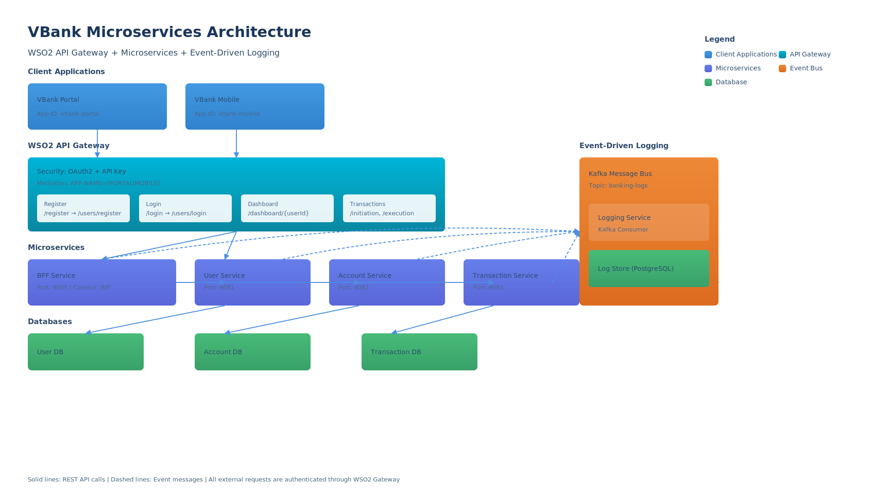

# Banking Microservices Project

A modern banking system built with microservices architecture, featuring WSO2 API Gateway for security and API management, event-driven logging with Kafka, and PostgreSQL databases.



## 🏗 Architecture Overview

### Core Components

1. **WSO2 API Gateway**
   - Centralized entry point for all client requests
   - OAuth2 + API Key authentication
   - Request throttling and CORS support
   - Client identification via APP-NAME header (PORTAL/MOBILE)

2. **Microservices**
   - **User Service** (Port: 8081)
     - User registration and authentication
     - User profile management
   - **Account Service** (Port: 8082)
     - Account creation and management
     - Balance inquiries
   - **Transaction Service** (Port: 8083)
     - Fund transfer initiation and execution
     - Transaction history
   - **BFF (Backend for Frontend) Service** (Port: 8085)
     - API aggregation and composition
     - Client-specific response optimization

3. **Event-Driven Logging**
   - Kafka message broker
   - Centralized logging service
   - PostgreSQL log store

### API Products

#### VBank API Product
- Register: `/register` → `/users/register`
- Login: `/login` → `/users/login`
- Dashboard: `/dashboard/{userId}` → `/bff/dashboard/{userId}`
- Transactions:
  - `/initiation` → `/transactions/transfer/initiation`
  - `/execution` → `/transactions/transfer/execution`

## 🚀 Getting Started

### Prerequisites
- Java 17 or higher
- Maven 3.6+
- Docker and Docker Compose
- WSO2 API Manager
- PostgreSQL 12+
- Kafka

### Environment Setup

1. **Database Setup**
```bash
docker-compose -f docker-compose_DB.yml up -d
```

2. **Kafka Setup**
```bash
# Included in docker-compose.yml
docker-compose up -d kafka zookeeper
```

3. **Start Microservices**
```bash
# Build and run each service
cd user-service && mvn spring-boot:run
cd account-service && mvn spring-boot:run
cd transaction-service && mvn spring-boot:run
cd bff-service && mvn spring-boot:run
cd logging-service && mvn spring-boot:run
```

### WSO2 API Gateway Configuration

1. Import API definitions
2. Configure security schemes (OAuth2 + API Key)
3. Set up rate limiting and throttling policies
4. Create applications:
   - VBank Portal (Web)
   - VBank Mobile

## 📝 API Documentation

### User Service APIs
- POST `/users/register` - Register new user
- POST `/users/login` - Authenticate user

### Account Service APIs
- GET `/accounts/{userId}` - Get user accounts
- POST `/accounts/create` - Create new account
- GET `/accounts/{accountId}/balance` - Get account balance

### Transaction Service APIs
- POST `/transactions/transfer/initiation` - Initiate transfer
- POST `/transactions/transfer/execution` - Execute transfer
- GET `/transactions/{accountId}` - Get transaction history

### BFF Service APIs
- GET `/bff/dashboard/{userId}` - Get user dashboard data
- POST `/bff/transactions` - Handle transaction requests

## 🔒 Security

- OAuth2 authentication for all endpoints
- API Key validation for client identification
- SSL/TLS encryption for all communications
- Role-based access control (RBAC)
- Request validation and sanitization

## 📊 Logging and Monitoring

All services emit logs to Kafka topic `banking-logs`, which are:
1. Consumed by the logging service
2. Stored in PostgreSQL for audit trails
3. Available for monitoring and analytics

## 🧪 Testing

### Postman Collections
1. `Banking_Microservices_Project.postman_collection.json` - Core APIs
2. `Banking_WSO2_API_Gateway.postman_collection.json` - Gateway integration
3. `AccountService.postman_collection.json` - Account specific tests

### Running Tests
```bash
# Run service unit tests
mvn test

# Run integration tests
mvn verify
```

## 🐳 Docker Support

### Build Images
```bash
# Build all services
docker-compose build

# Run entire stack
docker-compose up -d
```

## 📚 Additional Resources

- [WSO2 API Manager Documentation](https://apim.docs.wso2.com)
- [Spring Boot Documentation](https://docs.spring.io/spring-boot/docs/current/reference/html/)
- [Kafka Documentation](https://kafka.apache.org/documentation/)

## 👥 Contributors

- Project Development: Mostafa Alaa Eldin Hassan
- Mentors:
  - Java Development: Aya Abed, Maria Onsy
  - WSO2 Gateway: Omar Salah

## 📄 License

This project is licensed under the MIT License - see the LICENSE file for details.
